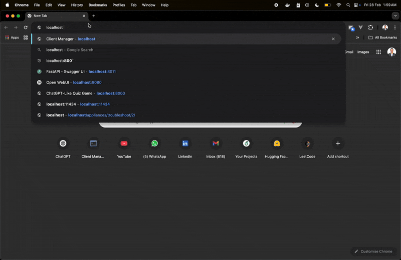

# WebApp

A simple Spring Boot application with CRUD functionality for managing clients, built using Spring Boot, Thymeleaf, and MySQL.

---

## Demo

Here's a quick demo of the application in action:




## Table of Contents

- [Features](#features)
- [Prerequisites](#prerequisites)
- [Installation](#installation)
- [Running Locally](#running-locally)
- [Running with Docker](#running-with-docker)
- [Configuration](#configuration)
- [Endpoints](#endpoints)
- [Project Structure](#project-structure)
- [Contributing](#contributing)
- [License](#license)


---

## Features

- **CRUD Operations**: Create, read, update, and delete clients.
- **Thymeleaf Templates**: User-friendly views for managing client data.
- **Database Integration**: MySQL database for persistent storage.
- **RESTful APIs**: Easily extendable for API access.
---

## Prerequisites

Ensure you have the following installed on your system:

- Java 17+
- Maven 3.6+
- MySQL 8+
- Docker (optional, for containerization)

---

## Installation

1. **Clone the Repository**
   ```bash
   git clone https://github.com/ErVijayRaghuwanshi/springboot-crud-app.git
   cd webapp
   ```

2. **Set Up the Database**
   Create a MySQL database named `my_database` (or update the configuration in `application.properties`).

   ```sql
   CREATE DATABASE my_database;
   CREATE USER 'admin'@'%' IDENTIFIED BY 'admin123';
   GRANT ALL PRIVILEGES ON my_database.* TO 'admin'@'%';
   FLUSH PRIVILEGES;
   ```

3. **Configure the Application**
   Update the `src/main/resources/application.properties` file:
   ```properties
   spring.datasource.url=jdbc:mysql://localhost:3306/my_database
   spring.datasource.username=admin
   spring.datasource.password=admin123
   ```

4. **Build the Application**
   ```bash
   mvn clean package
   ```

---

## Running Locally

1. **Run the Application**
   ```bash
   java -jar target/webapp-0.0.1-SNAPSHOT.jar
   ```

2. **Access the Application**
   Open your browser and navigate to `http://localhost`.

---

## Running with Docker

1. **Build the Docker Image**
   ```bash
   docker build -t webapp .
   ```

2. **Run the Docker Container**
   ```bash
   docker run -d -p 80:80 --name webapp-container webapp
   ```

3. **Access the Application**
   Open your browser and navigate to `http://localhost`.

### Docker Compose (Optional)
To run the application with MySQL using Docker Compose:

1. Create a `docker-compose.yml` file:
   ```yaml
   version: '3.8'
   services:
     webapp:
       build: .
       ports:
         - "80:80"
       environment:
         SPRING_DATASOURCE_URL: jdbc:mysql://db:3306/my_database
         SPRING_DATASOURCE_USERNAME: admin
         SPRING_DATASOURCE_PASSWORD: admin123
       depends_on:
         - db
     db:
       image: mysql:8
       environment:
         MYSQL_ROOT_PASSWORD: root
         MYSQL_DATABASE: my_database
         MYSQL_USER: admin
         MYSQL_PASSWORD: admin123
       ports:
         - "3306:3306"
   ```

2. Run with Docker Compose:
   ```bash
   docker-compose up
   ```

---

## Configuration

You can override configurations in several ways:

1. **External `application.properties` File**:
   ```bash
   java -jar webapp-0.0.1-SNAPSHOT.jar --spring.config.location=/path/to/application.properties
   ```

2. **Environment Variables**:
   ```bash
   export SPRING_DATASOURCE_URL=jdbc:mysql://localhost:3306/new_database
   export SERVER_PORT=8081
   java -jar webapp-0.0.1-SNAPSHOT.jar
   ```

3. **Command-Line Arguments**:
   ```bash
   java -jar webapp-0.0.1-SNAPSHOT.jar --server.port=8081 --spring.datasource.url=jdbc:mysql://localhost:3306/new_database
   ```

---

## Endpoints

### Web Endpoints
- `GET /`: Home page.
- `GET /clients`: List of clients.
- `GET /clients/create`: Form to create a new client.
- `POST /clients`: Create a new client.
- `GET /clients/edit/{id}`: Form to edit a client.
- `POST /clients/edit/{id}`: Update client details.
- `DELETE /clients/{id}`: Delete a client.

### API Endpoints
You can extend the application to expose RESTful endpoints if needed.

---

## Project Structure

```
src
├── main
│   ├── java/com/bmt/webapp
│   │   ├── WebappApplication.java         # Main Spring Boot application
│   │   ├── controllers                    # Controllers for handling requests
│   │   ├── models                         # Models for database entities
│   │   └── repositories                   # JPA Repositories
│   └── resources
│       ├── application.properties         # Application configuration
│       ├── templates                      # Thymeleaf templates
│       └── static                         # Static files (CSS, JS, etc.)
└── test                                   # Unit tests
```

---

## Contributing

1. Fork the repository.
2. Create a feature branch:
   ```bash
   git checkout -b feature/your-feature
   ```
3. Commit your changes:
   ```bash
   git commit -m "Add your feature"
   ```
4. Push to the branch:
   ```bash
   git push origin feature/your-feature
   ```
5. Open a pull request.

---

## License

This project is licensed under the MIT License. See the `LICENSE` file for details.

---

Let me know if you need further customization! 😊